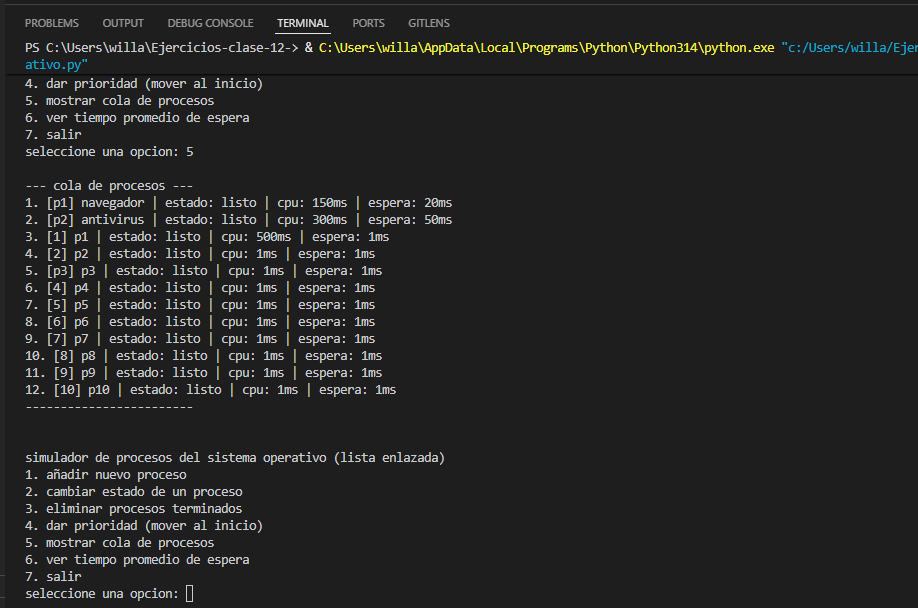
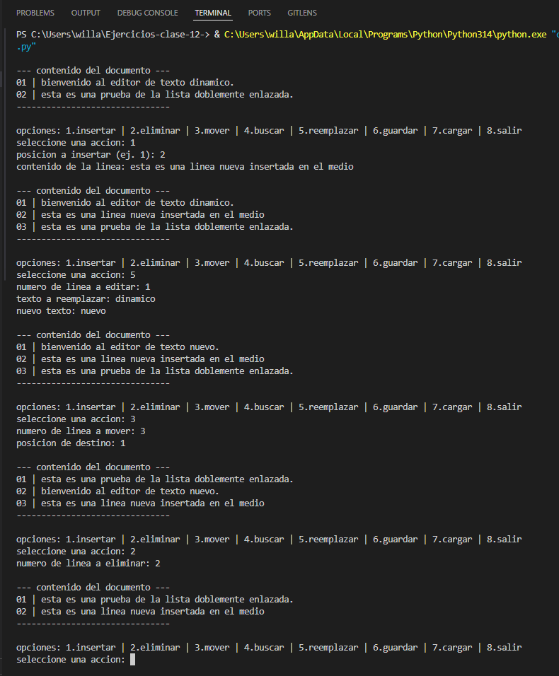
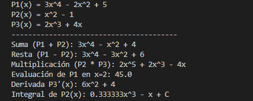
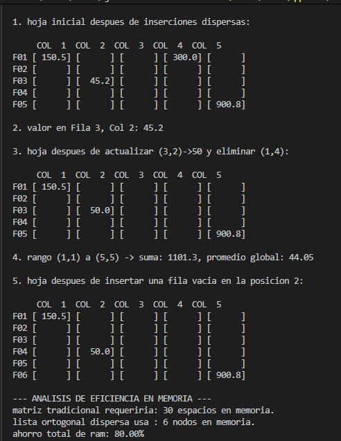

# Ejercicios-clase-12-

EJ1: Para este simulador se implementó una lista simplemente enlazada, permitiendo una gestión de memoria dinámica muy superior a los arreglos tradicionales. Al priorizar procesos o eliminar terminados, el programa únicamente reconecta los punteros de los nodos, evitando el costoso desplazamiento de datos. El sistema integra un menú interactivo y manejo de excepciones, garantizando robustez y ejecución en tiempo constante.

EJ2: Se implementó una lista doblemente enlazada, ya que permite una navegación bidireccional esencial para la manipulación de texto. Al insertar, mover o eliminar líneas, el sistema únicamente ajusta los punteros anterior y siguiente de los nodos vecinos, operando en tiempo constante sin necesidad de reasignar toda la memoria como ocurriría con un arreglo de cadenas. El diseño modular facilita integrar carga y guardado de archivos de forma secuencial y altamente eficiente.

EJ3: Se implementó una lista simplemente enlazada ordenada para representar polinomios dispersos de forma eficiente. Al almacenar el coeficiente y el exponente en cada nodo y evitar el registro de ceros, el sistema ahorra memoria al máximo y procesa derivadas, integrales y multiplicaciones iterando únicamente sobre los términos algebraicos reales y existentes.

EJ4: Se desarrolló una matriz ortogonal mediante listas enlazadas dobles cruzadas, gestionando punteros derecha y abajo por cada celda. Esta arquitectura es infinitamente más eficiente que una matriz bidimensional tradicional, ya que únicamente reserva memoria RAM para las coordenadas que contienen valores reales, omitiendo los espacios vacíos y desplazando bloques enteros de índices en tiempo constante durante las inserciones estructurales de filas.

